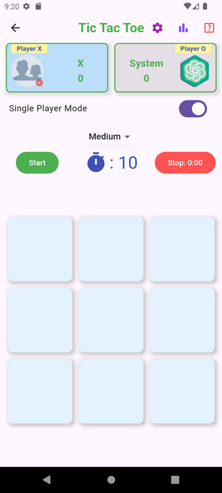
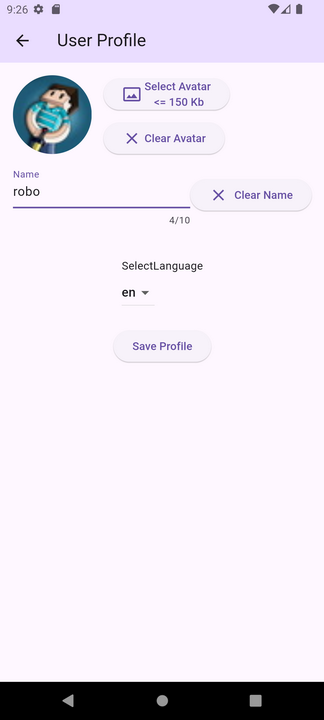
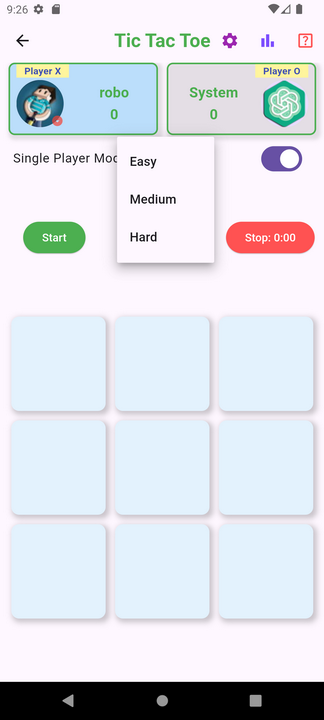
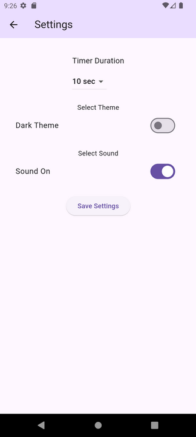
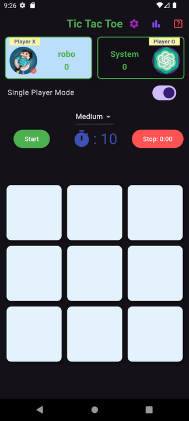
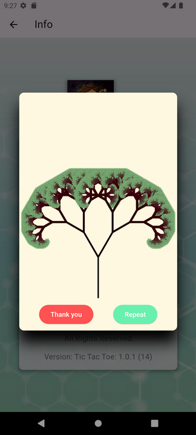
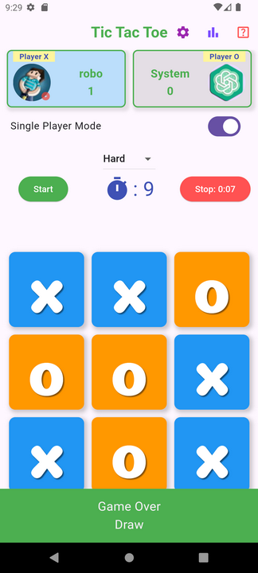

# Tic-Tac-Toe

mastorramos@gmail.com

2024 (c) 

A simple game for any age!

Has 3 difficulty levels. I have an opportunity:
1. Choose a light or dark theme. 2. Disable or enable sounds.
3. Select the language of communication.
4. Choose to play with two or one player with a device.
5. You can create your own profile with an avatar and name.
6. It is possible to save and view game statistics.

Technologies used:
localizations, audio players,
firebase, firebase auth, firestore, firebase storage, firebase app check
image, path, connectivity
shared preferences, dotenv
provider, flutter bloc, equatable

//************************************************************************

Prosta gra dla każdego wieku!
Posiada 3 poziomy trudności. Mam okazję:
1. Wybierz jasny lub ciemny motyw. 2. Wyłącz lub włącz dźwięki.
3. Wybierz język komunikacji.
4. Wybierz grę z dwoma lub jednym graczem za pomocą urządzenia.
5. Możesz stworzyć swój własny profil z awatarem i nazwą.
6. Istnieje możliwość zapisywania i przeglądania statystyk gry.

Wykorzystane technologie:
lokalizacje, odtwarzacze audio,
Firebase, uwierzytelnianie Firebase, Firestore, przechowywanie Firebase, sprawdzanie aplikacji Firebase
obraz, ścieżka, łączność
wspólne preferencje, dotenv
dostawca, blok trzepotania, równy

//************************************************************************

Проста гра для будь-якого віку!
Має 3 рівні складності. Є можливість:
1. Вибрати світлу чи темну тему. 2. Вимкнути або увімкнути звуки.
3. Вибрати мову спілкування.
4. Вибрати грати двом чи одному гравцю з девайсом.
5. Можна створити свій профіль із аватаркою та ім'ям.
6. Є можливість збереження та перегляду статистики гри.

Використовувалися технології:
localizations, audioplayers,
firebase, firebase auth, firestore, firebase storage, firebase app check
image, path, connectivity
shared preferences, dotenv
provider, flutter bloc, equatable

//************************************************************************

Простая игра для любого возраста!
Имеет 3 уровня сложности. Есть возможность:
1. Выбрать светлую или темную тему. 2. Отключить или включить звуки.
3. Выбрать язык общения.
4. Выбрать играть двоим или одиному игроку с девайсом.
5. Можно создать свой профиль с аватаркой и именем.
6. Есть возможность сохранения и просмотра статистики игры.

Использовались технологии:
localizations, audioplayers, 
firebase, firebase auth, firestore, firebase storage, firebase app check
image, path, connectivity
shared preferences, dotenv
provider, flutter bloc, equatable

   

